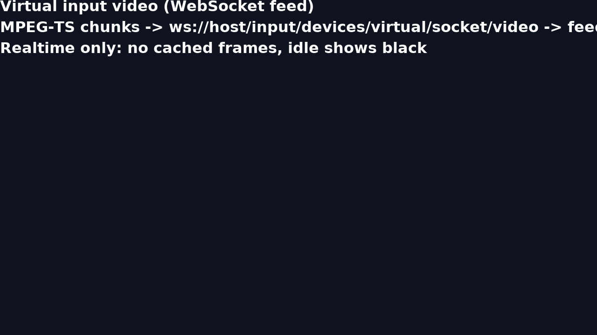
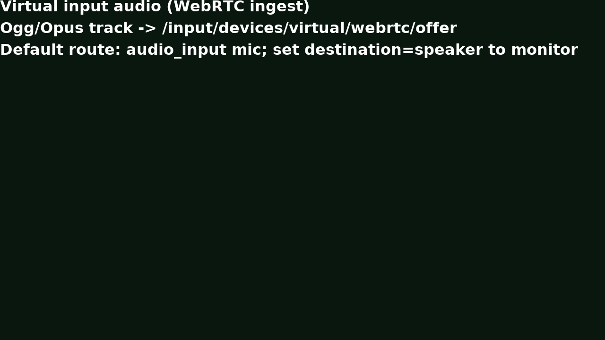
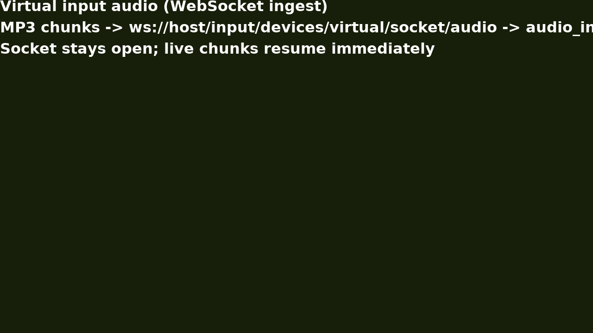
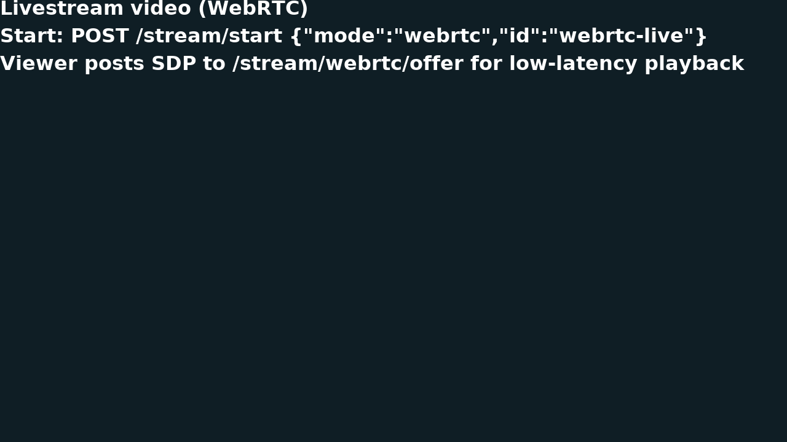
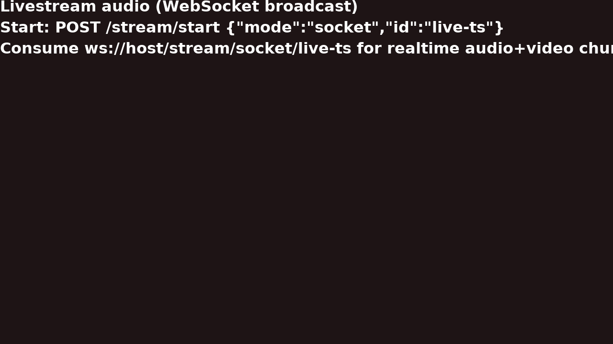
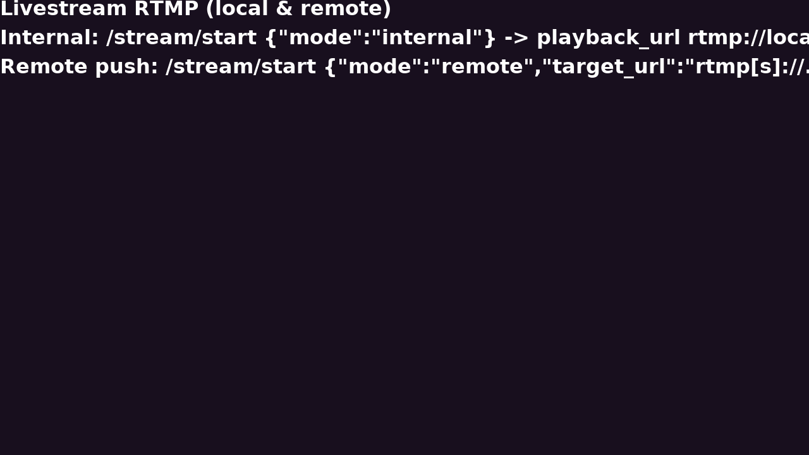

# PR Doc — Virtual Inputs & Livestreams

Straight-to-the-point rundown of the new realtime ingest + broadcast paths. Host access uses `http://localhost:444/...` (inside the container keep `10001`). All media references live in `samples/`.

## Utilities & runnable flows (derived from samples)

### Virtual input video — WebRTC + feed

- Configure both tracks on WebRTC and mirror to the feed page (blank until live chunks arrive):
```bash
curl -s http://localhost:444/input/devices/virtual/configure \
  -H "Content-Type: application/json" \
  -d '{"video":{"type":"webrtc"},"audio":{"type":"webrtc"}}' | jq '.ingest'
# -> { "video": {"protocol":"webrtc","url":"http://.../virtual/webrtc/offer","format":"ivf"}, "audio": {...,"destination":"microphone"} }
sh samples/virtual-inputs/run_webrtc.sh  # offers video+audio via aiortc player -> mirrors to /input/devices/virtual/feed
```
- Feed page stays realtime: reloads show black when idle; only fresh chunks render. Use `samples/virtual-inputs/feed_capture.js` to confirm format hints toggle `.ivf/.mpegts` automatically.

### Virtual input video — WebSockets + feed

- Keep both streams on sockets; JSMpeg expects MPEG-1 in TS:
```bash
curl -s http://localhost:444/input/devices/virtual/configure \
  -H "Content-Type: application/json" \
  -d '{"video":{"type":"socket","format":"mpegts","width":1280,"height":720,"frame_rate":30},"audio":{"type":"socket","format":"mp3"}}' \
  | jq '.ingest'
node samples/virtual-inputs/ws_chunk_ingest.js  # streams TS+MP3 chunks, sockets stay open for new bursts
open http://localhost:444/input/devices/virtual/feed?fit=cover  # realtime only; no cached replay after refresh
```

### Virtual input audio — WebRTC

- Audio defaults to the virtual mic (`audio_input`); flip to speaker when monitoring:
```bash
curl -s http://localhost:444/input/devices/virtual/configure \
  -H "Content-Type: application/json" \
  -d '{"audio":{"type":"webrtc"}}' | jq '.ingest.audio'
# destination defaults to "microphone"; set {"destination":"speaker"} to monitor instead
```
- Expect SDP answer from `/input/devices/virtual/webrtc/offer`; silence when idle, instant resume on new Opus frames.

### Virtual input audio — WebSockets

- MP3 chunks to the mic by default; sockets stay hot even when quiet:
```bash
curl -s http://localhost:444/input/devices/virtual/configure \
  -H "Content-Type: application/json" \
  -d '{"audio":{"type":"socket","format":"mp3"}}' | jq '.ingest.audio'
node samples/virtual-inputs/ws_chunk_ingest.js  # sends MP3 frames to ws://localhost:444/input/devices/virtual/socket/audio
```
- Status stays `running`; when chunks stop the mic is silent, and new sends are picked up immediately without replay.

### Livestream video — WebRTC

- Start a realtime viewer-friendly mirror of the display (with audio):
```bash
curl -s http://localhost:444/stream/start \
  -H "Content-Type: application/json" \
  -d '{"mode":"webrtc","id":"webrtc-live"}' | jq
# -> includes "webrtc_offer_url": "http://localhost:444/stream/webrtc/offer"
curl -s http://localhost:444/stream/webrtc/offer \
  -H "Content-Type: application/json" \
  -d '{"id":"webrtc-live","sdp":"<viewer-offer-sdp>"}' | jq '.sdp'
```
- Set the returned SDP as remote description on the viewer; stream is ~realtime and pauses cleanly when the display is idle.

### Livestream audio — WebSockets

- Broadcast MPEG-TS chunks (audio + display) over a named websocket:
```bash
curl -s http://localhost:444/stream/start \
  -H "Content-Type: application/json" \
  -d '{"mode":"socket","id":"live-ts"}' | jq '.websocket_url'
node --input-type=module - <<'NODE'
import WebSocket from 'ws'; import fs from 'node:fs';
const ws = new WebSocket('ws://localhost:444/stream/socket/live-ts');
const out = fs.createWriteStream('capture.ts');
ws.on('message', c => out.write(c));
ws.on('close', () => out.end());
NODE
```
- Low-latency audio follows the display’s speaker; idle periods keep the socket open without replay.

### Livestream RTMP — internal & remote

- Internal RTMP server (preview locally):
```bash
curl -s http://localhost:444/stream/start \
  -H "Content-Type: application/json" \
  -d '{"mode":"internal"}' | jq '.playback_url'
ffplay -fflags nobuffer -i rtmp://localhost:1935/live/default
```
- Remote push:
```bash
curl -s http://localhost:444/stream/start \
  -H "Content-Type: application/json" \
  -d '{"mode":"remote","target_url":"rtmp://example.com/live/default"}'
curl -X POST http://localhost:444/stream/stop  # stop any mode/id
```

## API quick reference (new/updated)
- `POST /input/devices/virtual/configure` — `video` and `audio` objects hold their own `width/height/frame_rate` or `format`; audio `destination` (`microphone` default, `speaker` for monitoring). Supports `stream`, `file`, `socket`, `webrtc`.
- `POST /input/devices/virtual/pause|resume|stop` — maintains open pipelines; pause injects black/silence; resume is live-only (no cached frames).
- `GET /input/devices/virtual/status` — returns `state`, sinks/sources, last error, and `ingest` endpoints (protocol + format + destination).
- `GET /input/devices/virtual/feed` — fullscreen HTML preview; `fit`/`source` query params; honors realtime blanking when idle.
- `GET /input/devices/virtual/feed/socket/info` — reveals websocket URL + format hint (`mpegts`/`ivf`) for mirroring/capture.
- `POST /input/devices/virtual/webrtc/offer` — negotiate ingest; expects SDP offer, returns SDP answer (Opus audio to mic by default).
- `POST /stream/start` — modes: `internal` (RTMP server with playback URLs), `remote` (push to `target_url` RTMP/S), `webrtc` (viewer SDP endpoint), `socket` (MPEG-TS websocket broadcast). Optional `id` and `framerate`.
- `POST /stream/webrtc/offer` — viewer exchange for `webrtc` streams (`id` optional, default `default`).
- `GET /stream/list` — active streams with ingest/playback/socket endpoints; `POST /stream/stop` stops by `id` or the default stream.

Artifacts for reviewers: all supporting media live alongside this doc under `doc/` (seven annotated PNGs) and runnable helpers remain in `samples/virtual-inputs` and `samples/livestream`.
