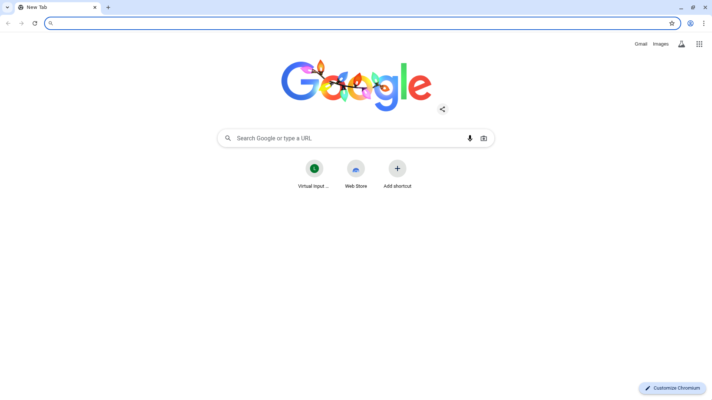

# Virtual Inputs & Livestream API

New capabilities for injecting media into the container and broadcasting the container's display.

---

## Virtual Inputs

Feed video/audio into the container's virtual webcam and microphone from external sources.

### API Endpoints

| Endpoint | Method | Description |
|----------|--------|-------------|
| `/input/devices/virtual/configure` | POST | Configure video/audio input sources |
| `/input/devices/virtual/status` | GET | Get current pipeline status |
| `/input/devices/virtual/pause` | POST | Pause (black frames/silence) |
| `/input/devices/virtual/resume` | POST | Resume playback |
| `/input/devices/virtual/stop` | POST | Stop and release resources |
| `/input/devices/virtual/feed` | GET | HTML preview page |
| `/input/devices/virtual/feed/socket/info` | GET | WebSocket feed endpoint info |
| `/input/devices/virtual/webrtc/offer` | POST | WebRTC SDP negotiation |

---

### 1. HTTP/HLS Stream Input

Configure video from HLS/DASH/RTMP URLs.

```bash
curl -s http://localhost:444/input/devices/virtual/configure \
  -H "Content-Type: application/json" \
  -d '{
    "video": {
      "type": "stream",
      "url": "https://test-streams.mux.dev/x36xhzz/x36xhzz.m3u8",
      "width": 1280,
      "height": 720,
      "frame_rate": 30
    },
    "audio": {
      "type": "stream",
      "url": "http://icecast.err.ee/r2rock.opus"
    }
  }'
```

**Response:**
```json
{
  "audio": {
    "type": "stream",
    "url": "http://icecast.err.ee/r2rock.opus"
  },
  "audio_file": "/tmp/virtual-inputs/audio.wav",
  "audio_sink": "audio_input",
  "microphone_source": "microphone",
  "mode": "virtual-file",
  "started_at": "2025-12-10T09:54:49.632400817-08:00",
  "state": "running",
  "video": {
    "frame_rate": 30,
    "height": 720,
    "type": "stream",
    "url": "https://test-streams.mux.dev/x36xhzz/x36xhzz.m3u8",
    "width": 1280
  },
  "video_device": "/dev/video20",
  "video_file": "/tmp/virtual-inputs/video.y4m"
}
```

---

### 2. WebSocket Chunked Input

Stream MPEG-TS video chunks and MP3 audio chunks over WebSocket for real-time ingest.

```bash
curl -s http://localhost:444/input/devices/virtual/configure \
  -H "Content-Type: application/json" \
  -d '{
    "video": {
      "type": "socket",
      "format": "mpegts",
      "width": 1280,
      "height": 720,
      "frame_rate": 30
    },
    "audio": {
      "type": "socket",
      "format": "mp3"
    }
  }'
```

**Response:**
```json
{
  "audio": {
    "format": "mp3",
    "type": "socket",
    "url": "/tmp/virtual-inputs/ingest-audio.pipe"
  },
  "audio_sink": "audio_input",
  "ingest": {
    "audio": {
      "format": "mp3",
      "protocol": "socket",
      "url": "/input/devices/virtual/socket/audio"
    },
    "video": {
      "format": "mpegts",
      "protocol": "socket",
      "url": "/input/devices/virtual/socket/video"
    }
  },
  "microphone_source": "microphone",
  "mode": "virtual-file",
  "state": "running",
  "video": {
    "format": "mpegts",
    "frame_rate": 30,
    "height": 720,
    "type": "socket",
    "width": 1280
  },
  "video_device": "/dev/video20"
}
```

#### Sending Chunks (Node.js)

```javascript
import WebSocket from 'ws';
import { createReadStream } from 'node:fs';

const HOST = 'localhost:444';
const ws = new WebSocket(`ws://${HOST}/input/devices/virtual/socket/video`);

ws.on('open', async () => {
  for await (const chunk of createReadStream('video.ts', { highWaterMark: 64 * 1024 })) {
    ws.send(chunk);
    await new Promise(r => setTimeout(r, 35)); // pace chunks
  }
});
```

**Preparing MPEG-1 video for JSMpeg playback:**
```bash
ffmpeg -i input.mp4 -c:v mpeg1video -b:v 1500k -f mpegts output.ts
```

---

### 3. WebRTC Input

Stream video/audio via WebRTC peer connection.

```bash
curl -s http://localhost:444/input/devices/virtual/configure \
  -H "Content-Type: application/json" \
  -d '{"video":{"type":"webrtc"},"audio":{"type":"webrtc"}}'
```

**Response:**
```json
{
  "audio": {
    "format": "ogg",
    "type": "webrtc",
    "url": "/tmp/virtual-inputs/ingest-audio.pipe"
  },
  "audio_sink": "audio_input",
  "ingest": {
    "audio": {
      "format": "ogg",
      "protocol": "webrtc",
      "url": "/input/devices/virtual/webrtc/offer"
    },
    "video": {
      "format": "ivf",
      "protocol": "webrtc",
      "url": "/input/devices/virtual/webrtc/offer"
    }
  },
  "microphone_source": "microphone",
  "mode": "virtual-file",
  "state": "running",
  "video": {
    "format": "ivf",
    "frame_rate": 30,
    "height": 720,
    "type": "webrtc"
  },
  "video_device": "/dev/video20"
}
```

#### SDP Offer/Answer (Python)

```python
import asyncio, aiohttp
from aiortc import RTCPeerConnection, RTCSessionDescription
from aiortc.contrib.media import MediaPlayer

async def main():
    pc = RTCPeerConnection()
    player = MediaPlayer("video.mp4")
    if player.video:
        pc.addTrack(player.video)
    if player.audio:
        pc.addTrack(player.audio)

    offer = await pc.createOffer()
    await pc.setLocalDescription(offer)

    async with aiohttp.ClientSession() as session:
        resp = await session.post(
            "http://localhost:444/input/devices/virtual/webrtc/offer",
            json={"sdp": pc.localDescription.sdp}
        )
        answer = await resp.json()

    await pc.setRemoteDescription(
        RTCSessionDescription(sdp=answer["sdp"], type="answer")
    )
    await asyncio.Future()  # keep streaming

asyncio.run(main())
```

---

### 4. Audio Destination Routing

By default, audio goes to the virtual microphone. Use `destination` to route to the speaker instead.

**Route to microphone (default):**
```bash
curl -s http://localhost:444/input/devices/virtual/configure \
  -H "Content-Type: application/json" \
  -d '{
    "audio": {
      "type": "stream",
      "url": "http://icecast.err.ee/r2rock.opus"
    }
  }'
```

**Route to speaker:**
```bash
curl -s http://localhost:444/input/devices/virtual/configure \
  -H "Content-Type: application/json" \
  -d '{
    "audio": {
      "type": "stream",
      "url": "http://icecast.err.ee/r2rock.opus",
      "destination": "speaker"
    }
  }'
```

| Destination | PulseAudio Sink | Use Case |
|-------------|-----------------|----------|
| `microphone` | `audio_input` | Virtual mic for apps reading mic input |
| `speaker` | `audio_output` | Monitor/playback through container audio |

---

### 5. Feed Preview Page

View the virtual input video in a fullscreen HTML page.

```
http://localhost:444/input/devices/virtual/feed?fit=cover
```

Query params:
- `fit`: CSS object-fit value (`cover`, `contain`, etc.)
- `source`: Override video source

**Get WebSocket feed info:**
```bash
curl -s http://localhost:444/input/devices/virtual/feed/socket/info
```
```json
{"format":"mpegts","url":"/input/devices/virtual/feed/socket"}
```

**Real-time behavior:** The feed page shows only live chunks. No caching or replay. When no chunks are being sent, the page displays "Loading virtual feed..." status.

---

### 6. Pipeline Control

**Pause (black frames/silence):**
```bash
curl -X POST http://localhost:444/input/devices/virtual/pause
```

**Resume:**
```bash
curl -X POST http://localhost:444/input/devices/virtual/resume
```

**Stop:**
```bash
curl -X POST http://localhost:444/input/devices/virtual/stop
```

**Status:**
```bash
curl -s http://localhost:444/input/devices/virtual/status
```
```json
{
  "audio_sink": "audio_input",
  "microphone_source": "microphone",
  "mode": "device",
  "state": "idle",
  "video_device": "/dev/video20"
}
```

---

## Livestream

Broadcast the container's display to external viewers.

### API Endpoints

| Endpoint | Method | Description |
|----------|--------|-------------|
| `/stream/start` | POST | Start livestream |
| `/stream/stop` | POST | Stop livestream |
| `/stream/list` | GET | List active streams |
| `/stream/webrtc/offer` | POST | WebRTC SDP negotiation |
| `/stream/socket/{id}` | WS | WebSocket MPEG-TS stream |

---

### 1. Internal RTMP Mode

Start a local RTMP server for playback.

```bash
curl -s http://localhost:444/stream/start \
  -H "Content-Type: application/json" \
  -d '{"mode":"internal"}'
```

**Response:**
```json
{
  "id": "default",
  "ingest_url": "rtmp://127.0.0.1:1935/live/default",
  "is_streaming": true,
  "mode": "internal",
  "playback_url": "rtmp://127.0.0.1:1935/live/default",
  "secure_playback_url": "rtmps://127.0.0.1:1936/live/default",
  "started_at": "2025-12-10T09:55:51.758988-08:00",
  "webrtc_offer_url": null,
  "websocket_url": null
}
```

**Playback with ffplay:**
```bash
ffplay -fflags nobuffer -i rtmp://localhost:1935/live/default
```

---

### 2. Remote RTMP Mode

Push to an external RTMP endpoint.

```bash
curl -s http://localhost:444/stream/start \
  -H "Content-Type: application/json" \
  -d '{"mode":"remote","target_url":"rtmp://live.example.com/app/stream-key"}'
```

---

### 3. WebSocket MPEG-TS Mode

Stream display as MPEG-TS chunks over WebSocket.

```bash
curl -s http://localhost:444/stream/start \
  -H "Content-Type: application/json" \
  -d '{"mode":"socket","id":"live-ts"}'
```

**Response:**
```json
{
  "id": "live-ts",
  "ingest_url": "",
  "is_streaming": true,
  "mode": "socket",
  "playback_url": null,
  "secure_playback_url": null,
  "started_at": "2025-12-10T09:56:27.370233531-08:00",
  "webrtc_offer_url": null,
  "websocket_url": "/stream/socket/live-ts"
}
```

**Capture stream (Node.js):**
```javascript
import fs from 'node:fs';
import WebSocket from 'ws';

const ws = new WebSocket('ws://localhost:444/stream/socket/live-ts');
const out = fs.createWriteStream('capture.ts');
ws.on('message', chunk => out.write(chunk));
ws.on('close', () => out.end());
```

---

### 4. WebRTC Mode

Expose the livestream via WebRTC for browser playback.

```bash
curl -s http://localhost:444/stream/start \
  -H "Content-Type: application/json" \
  -d '{"mode":"webrtc","id":"webrtc-live"}'
```

**Response:**
```json
{
  "id": "webrtc-live",
  "ingest_url": "",
  "is_streaming": true,
  "mode": "webrtc",
  "playback_url": null,
  "secure_playback_url": null,
  "started_at": "2025-12-10T09:56:49.008528316-08:00",
  "webrtc_offer_url": "/stream/webrtc/offer",
  "websocket_url": null
}
```

**SDP negotiation:**
```bash
curl -s http://localhost:444/stream/webrtc/offer \
  -H "Content-Type: application/json" \
  -d '{"id":"webrtc-live","sdp":"<your-offer-sdp>"}'
```

---

### 5. Stream Control

**List active streams:**
```bash
curl -s http://localhost:444/stream/list
```

**Stop stream:**
```bash
curl -s http://localhost:444/stream/stop \
  -H "Content-Type: application/json" \
  -d '{"id":"live-ts"}'
```

---

## Request/Response Schemas

### VirtualInputsRequest

```yaml
video:
  type: stream|file|socket|webrtc
  url: string           # for stream/file types
  format: string        # for socket/webrtc (mpegts, ivf, etc.)
  width: integer
  height: integer
  frame_rate: integer
audio:
  type: stream|file|socket|webrtc
  url: string
  format: string        # for socket/webrtc (mp3, ogg, etc.)
  destination: microphone|speaker  # default: microphone
start_paused: boolean
```

### StartStreamRequest

```yaml
id: string              # optional stream identifier
mode: internal|remote|webrtc|socket
target_url: string      # required for mode=remote
framerate: integer      # 1-20 fps
```

---

## Architecture

### Virtual Inputs Flow

```
                 ┌─────────────┐
   HTTP/HLS ────►│             │
                 │   Virtual   │───► /dev/video20 (v4l2)
   WebSocket ───►│   Inputs    │
                 │   Server    │───► audio_input (PulseAudio)
   WebRTC ──────►│             │
                 └──────┬──────┘
                        │
                        ▼
              ┌─────────────────┐
              │   Feed Page     │
              │ (JSMpeg/WebRTC) │
              └─────────────────┘
```

### Livestream Flow

```
                 ┌─────────────┐
                 │  Container  │
                 │   Display   │
                 └──────┬──────┘
                        │ ffmpeg
                        ▼
              ┌─────────────────┐
              │   Livestream    │
              │     Server      │
              └────────┬────────┘
                       │
         ┌─────────────┼─────────────┐
         ▼             ▼             ▼
      Internal       Remote       WebRTC/
       RTMP          RTMP        WebSocket
```

---

## Sample Media

Test files in `samples/virtual-inputs/media/`:
- `sample_video_mpeg1.ts` - MPEG-1 TS for JSMpeg
- `sample_video.ts` - H.264 MPEG-TS
- `sample_video.mp4` - MP4 clip
- `sample_audio.mp3` - MP3 audio
- `sample_audio.wav` - WAV audio

Helper scripts:
- `ws_chunk_ingest.js` - WebSocket chunk sender
- `run_webrtc.sh` - WebRTC Python helper
- `feed_capture.js` - Capture feed to file

---

## Desktop Screenshot



*Container desktop showing Chromium with the default new tab page. The virtual input feed page can be accessed at `/input/devices/virtual/feed`.*
